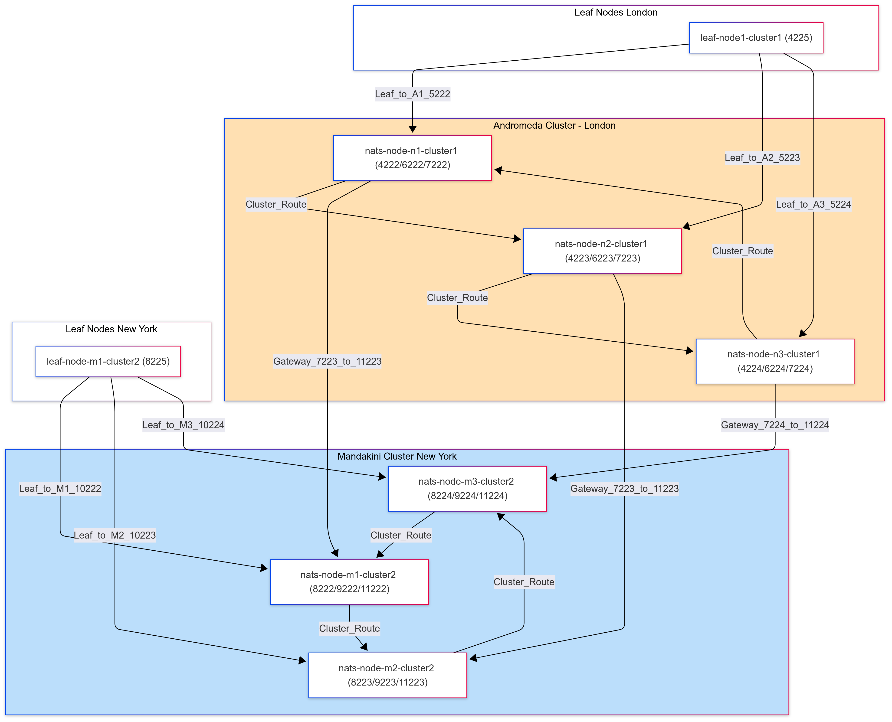

# NATS Multi-Cluster Topology

## Overview

This project sets up a multi-cluster NATS deployment with two main clusters—**Andromeda** and **Mandakini**—and associated leaf nodes. The clusters are interconnected via gateways, and each cluster has its own set of nodes and leaf node connections.

---

## Cluster Details

### Andromeda Cluster

- **Nodes:**
  - `nats-server-adromeda-1` (`nats-node-n1-cluster1.conf`):  
    - Client Port: 4222  
    - Cluster Port: 6222  
    - Leafnode Port: 5222  
    - Gateway Port: 7222  
  - `nats-server-adromeda-2`:  
    - Client Port: 4223  
    - Cluster Port: 6223  
    - Leafnode Port: 5223  
    - Gateway Port: 7223  
  - `nats-server-adromeda-3`:  
    - Client Port: 4224  
    - Cluster Port: 6224  
    - Leafnode Port: 5224  
    - Gateway Port: 7224  

- **Cluster Name:** `nats-cluster-andromeda`
- **Gateway Peers:** Mandakini cluster nodes

---

### Mandakini Cluster

- **Nodes:**
  - `nats-server-mandakini-1`:  
    - Client Port: 8222  
    - Cluster Port: 9222  
    - Leafnode Port: 10222  
    - Gateway Port: 11222  
  - `nats-server-mandakini-2` (`nats-node-m2-cluster2.conf`):  
    - Client Port: 8223  
    - Cluster Port: 9223  
    - Leafnode Port: 10223  
    - Gateway Port: 11223  
  - `nats-server-mandakini-3` (`nats-node-m3-cluster2.conf`):  
    - Client Port: 8224  
    - Cluster Port: 9224  
    - Leafnode Port: 10224  
    - Gateway Port: 11224  

- **Cluster Name:** `nats-cluster-mandakini`
- **Gateway Peers:** Andromeda cluster nodes

---

### Leaf Nodes

- **leaf-node-m1-cluster2**  
  - Port: 8225  
  - Connects to Mandakini nodes on leafnode ports 10222, 10223, 10224

- **leaf-node1-cluster1**  
  - Port: 4225  
  - Connects to Andromeda nodes on leafnode ports 5222, 5223, 5224

---

## Connectivity

- **Cluster routes** are defined between all nodes within each cluster for intra-cluster communication.
- **Gateways** connect the Andromeda and Mandakini clusters, allowing cross-cluster messaging.
- **Leaf nodes** connect to their respective clusters, extending the topology for edge or remote clients.

---

## Configuration Files

- Cluster and node configurations are located in the `configs/` directory:
  - `nats-node-n1-cluster1.conf`
  - `nats-node-m2-cluster2.conf`
  - `nats-node-m3-cluster2.conf`
  - (and others as needed)

---

## Diagram

Refer to the included `ny-london-nats-cluster.png` for a visual representation of the cluster and node topology.

---

## Accounts & Security

- Each node defines `SYS` and `APP` accounts with user/password authentication.
- Gateways use user/password authorization for secure inter-cluster connections.

---

## Usage

1. Start each NATS server with its respective configuration file.
2. Ensure all ports are available and not blocked by firewalls.
3. Use the diagram to verify connectivity and troubleshoot issues.

---

For more details, see the configuration files in the `configs/` directory.